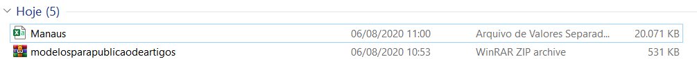

# rna-pp1-2020
Repositório para códigos, imagens e demais arquivos relacionados ao Projeto Prático 01 da disciplina de Redes Neurais Artificiais em 2020.1.

# Ambiente Virtual
A equipe optou por utilizar um Conda Env para o projeto. O mesmo se encontra na pasta **configs** com nome **rna_pp1.yml**.

## Instruções de ativação

Primero, navegue até o diretório em que se encontra o arquivo .yml baixado. Em seguida, para criar um ambiente a partir do arquivo,
utilize o comando ```conda-env create -n my_clone_env -f=\path\to\rna_pp1.yml ```

Para mais detalhes, [essa resposta](https://datascience.stackexchange.com/questions/24093/how-to-clone-python-working-environment-on-another-machine) contém bastante informação.

# Links Úteis

[Relatório LaTeX no Overleaf](https://pt.overleaf.com/7971632445grqrdnkdgnxn)

# Versão do Dataset

